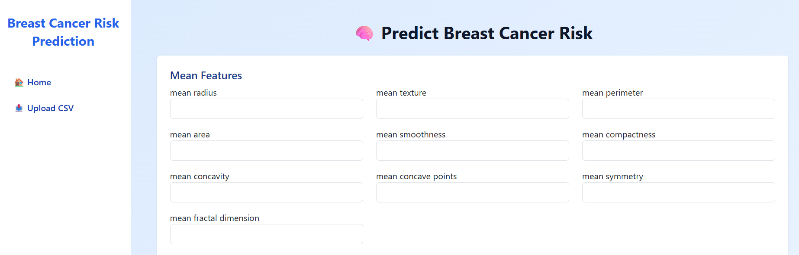
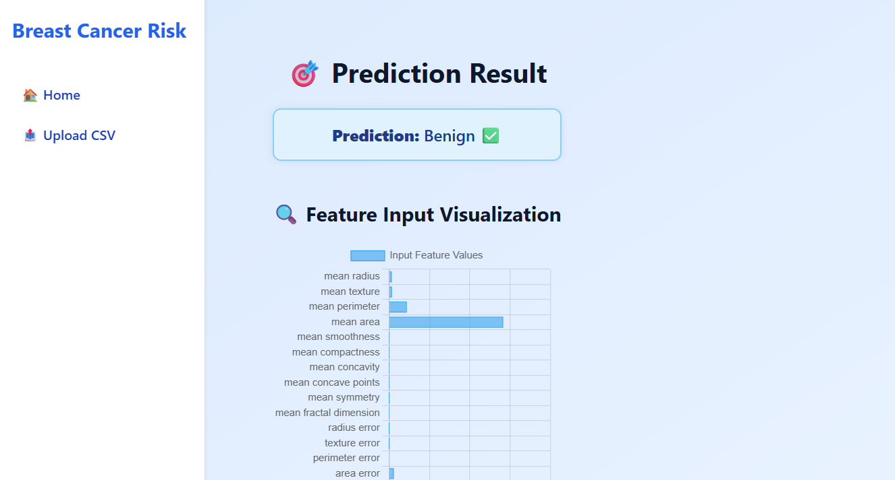

# 🔷 BlueScan – Breast Cancer Prediction App

BlueScan is a Machine Learning-powered web application that predicts the likelihood of breast cancer based on diagnostic data. Built with Flask and trained using Random Forest, the app allows both **manual input** and **CSV upload** for single or batch predictions. It also provides intuitive charts for better understanding.

🌐 **Live Demo**: [https://bluescan.onrender.com](https://bluescan.onrender.com)

---

## 📸 Screenshots

| Home Page | Prediction Result |
|-----------|-------------------|
|  |  |

> Replace these image paths with your actual screenshot files in a `screenshots/` folder

---

## 🧠 Features

- 🔍 Predicts breast cancer using 30 diagnostic features
- 🧾 Manual form input for one patient
- 📂 Upload CSV for batch predictions
- 📊 Visual graphs (e.g. prediction distribution)
- 📥 Downloadable prediction results
- 🌈 Clean, modern UI (gradient-based)
- ⚙️ Deployed live on Render

---

## 🛠️ Tech Stack

- Python 3.13
- Flask
- scikit-learn
- pandas, matplotlib, seaborn
- HTML, CSS (custom styling)

---

